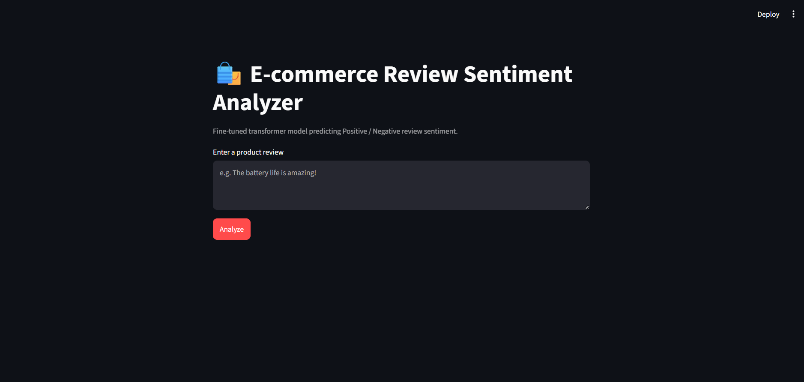
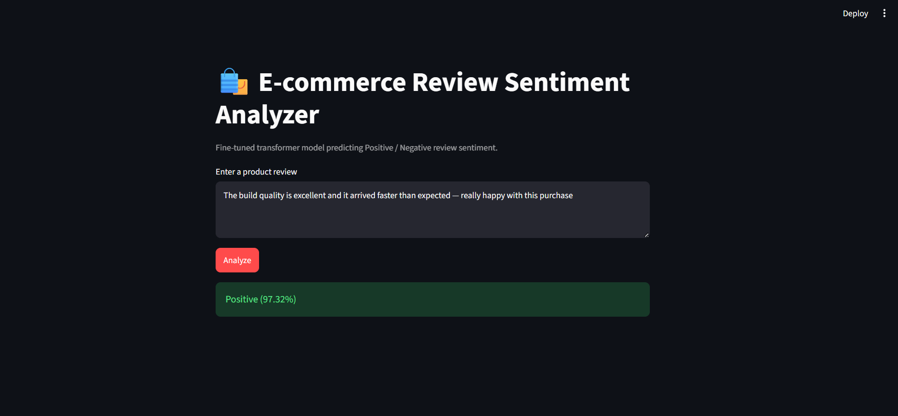

# 🛍️ E-commerce Review Sentiment Analyzer

[](https://github.com/Chowdri-Furkhan07/ecommerce-review-sentiment-analyzer/actions/workflows/ci.yml)


[](LICENSE)

A fine-tuned transformer model that classifies e-commerce product reviews as **Positive** or **Negative**, served through a Streamlit UI. Built with a modular, production-style structure: config-driven training, a reusable inference layer, unit tests, CI, and Docker packaging.

---

## Demo

| App | Prediction |
|---|---|
|  |  |

Enter a review and get a live prediction with a calibrated confidence score:

> "The build quality is excellent and it arrived faster than expected — really happy with this purchase" → **Positive (97.32%)**

---

## Features

- **Transformer-based classifier** - fine-tunes a Hugging Face model (`distilbert-base-uncased` by default) on labeled review text using the `Trainer` API.
- **Config via environment variables** - swap the base model, hyperparameters, or model path without touching code (`.env.example` provided).
- **Shared inference layer** - a single `SentimentPredictor` class is used by the Streamlit app, the CLI, and the tests, so prediction logic lives in exactly one place.
- **Honest confidence reporting** - predictions below a configurable confidence threshold are flagged as uncertain instead of being silently overridden by hand-written rules.
- **Class-imbalance aware training** - the dataset skews positive, so `train.py` computes class weights and applies a weighted cross-entropy loss to keep the minority (negative) class from being drowned out.
- **Unit tests + CI** - data cleaning and inference logic are covered by `pytest`, run automatically on every push via GitHub Actions.
- **Dockerized** - one command to build and run the app in a container.

---

## Project Structure

```
ecommerce-review-sentiment-analyzer/
├── src/
│   ├── config.py           # Centralized, env-driven configuration
│   ├── logger.py           # Shared logging setup
│   ├── data_processing.py  # Load, clean, and label the raw dataset
│   ├── dataset.py          # PyTorch Dataset wrapper
│   ├── train.py            # Fine-tuning script (CLI configurable)
│   ├── predict.py          # Inference wrapper (SentimentPredictor)
│   └── app.py               # Streamlit UI
├── tests/
│   ├── test_data_processing.py
│   └── test_predict.py
├── data/raw/                # Raw dataset (CSV)
├── models/                  # Trained model artifacts (git-ignored)
├── assets/                  # README screenshots
├── .github/workflows/ci.yml # Lint + test pipeline
├── Dockerfile
├── docker-compose.yml
├── requirements.txt
├── requirements-dev.txt
├── .env.example
└── pytest.ini
```

## Getting Started

### 1. Clone the repository

```bash
git clone https://github.com/Chowdri-Furkhan07/ecommerce-review-sentiment-analyzer.git
cd ecommerce-review-sentiment-analyzer
```

### 2. Install dependencies

```bash
python -m venv venv
source venv/bin/activate       # Windows: venv\Scripts\activate
pip install -r requirements-dev.txt
```

### 3. Configure (optional)

```bash
cp .env.example .env
# edit .env to change model, epochs, batch size, etc.
```

### 4. Train the model

```bash
python -m src.train
# or override hyperparameters directly:
python -m src.train --epochs 3 --batch-size 8 --model distilbert-base-uncased
```

This trains on `data/raw/ecommerce_reviews.csv`, evaluates each epoch (accuracy, precision, recall, F1), and saves the best checkpoint to `models/sentiment_model/`.

### 5. Run the app

```bash
streamlit run src/app.py
```

### 6. Run tests

```bash
pytest tests/ -v --cov=src
```

## Running with Docker

```bash
docker compose up --build
```

The app is available at `http://localhost:8501`. The `models/` directory is mounted as a volume, so train locally first (or mount a pre-trained model) - the image itself doesn't bundle model weights.

## How Labels Are Derived

Reviews don't come with a sentiment label directly, so one is derived from the star rating:

| Rating | Label        |
|--------|--------------|
| 4–5    | Positive (1) |
| 1–2    | Negative (0) |
| 3      | Dropped (ambiguous/neutral) |

## Dataset Notes

`data/raw/ecommerce_reviews.csv` (997 rows) is real Amazon product review data (product ID, star rating, free-text review). After cleaning, 903 rows remain across 4 unique products worth of review text with genuine variety.

Ratings skew positive (roughly 85% of the cleaned rows are 4–5 stars), which is typical of organic review data. To stop the model from just learning to always predict "positive," `src/train.py` computes class weights from the training split and applies them via a weighted cross-entropy loss (`WeightedTrainer`), so the minority (negative) class isn't drowned out during training.

If you swap in your own dataset, keep the same `review_id`, `product`, `rating`, `review_text` columns — no other code changes are required.

## Design Decisions

- **No keyword-matching fallback.** The model's prediction is always shown, along with its actual confidence, rather than being second-guessed by a hardcoded keyword list — so it's clear when a result should be treated with caution.
- **`AutoTokenizer` / `AutoModelForSequenceClassification`** instead of BERT-specific classes, so the base model can be swapped via config without code changes.
- **Stratified train/val split** to preserve class balance.
- **Early stopping** on validation F1 to avoid overfitting on a small dataset.

## Tech Stack

Python · PyTorch · Hugging Face Transformers · scikit-learn · Streamlit · pytest · Docker · GitHub Actions

## Author

**Chowdri Furkhan**

GitHub: [@Chowdri-Furkhan07](https://github.com/Chowdri-Furkhan07)

LinkedIn: [chowdri-furkhan](https://linkedin.com/in/chowdri-furkhan/)

## License

This project is licensed under the [MIT License](LICENSE).
